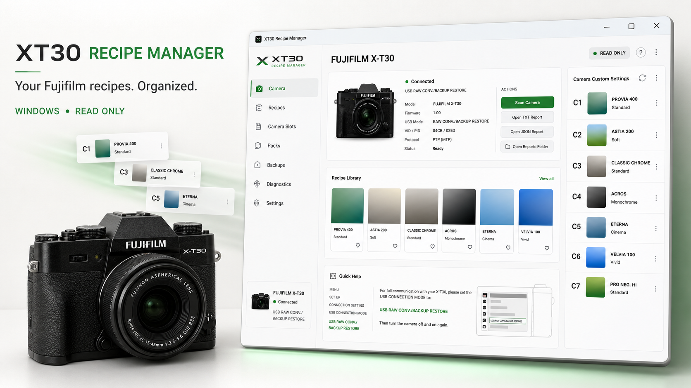

# XT30 Recipe Manager



Application Windows pour organiser des recettes Fujifilm et charger les banques
personnalisées **C1–C7** d'un **X-T30 première génération** (X-Trans CMOS 4 /
X-Processor 4).

L'application lit l'appareil, décode ses sept banques, et prépare un fichier de
réglages complet. **Elle n'envoie jamais de commande d'écriture au boîtier** :
c'est la FUJIFILM Tether App, par sa fonction officielle « BACKUP RESTORE », qui
effectue l'écriture. Les valeurs affichées comme `CAMERA` proviennent d'une
lecture réelle ; les autres restent marquées `LOCAL` ou `Not reported`.

> Projet indépendant et non affilié à FUJIFILM Corporation. Fujifilm et les noms
> de produits associés appartiennent à leurs détenteurs respectifs.

## Règle absolue

Le moteur PTP est **en lecture seule**, imposé par une liste blanche d'opcodes
unique et non contournable (`MtpReadOnlyGuard`). Sont autorisés uniquement :
`GetDeviceInfo`, `OpenSession`, `CloseSession`, `GetStorageIDs`,
`GetObjectInfo`, `GetObject`, `GetDevicePropDesc`, `GetDevicePropValue`.

Tout le reste est refusé : `SetDevicePropValue`, `SendObject`, `SendObjectInfo`,
`DeleteObject`, `SetObjectPropValue`, la capture, le changement de mode USB, et
**tous** les opcodes vendor. Le firmware n'est jamais approché.

## Ce que fait l'application

- **Lire l'appareil** — copie le fichier de réglages (objet PTP handle 0, format
  0x5000) et décode les sept banques : simulation, plage dynamique, priorité,
  tons, couleur, netteté, réduction du bruit, grain, Color Chrome, balance des
  blancs et nom.
- **Bibliothèque de recettes** — vos recettes plus les catalogues publics
  importés, filtrables par simulation, catégorie, compatibilité, favoris,
  photo/vidéo. Galerie complète des photos publiées avec chaque recette.
- **Créer vos recettes** — seules les valeurs que le X-T30 accepte réellement
  sont proposées : une recette créée ici est toujours transférable. Mode
  **photo** (banques C1–C7) ou **vidéo** (menus film du boîtier).
- **Charger C1–C7** — un panneau permanent à côté de l'état réel des banques :
  une recette par banque, le nom final et son compteur sur 25 caractères
  recalculés en direct, et un seul fichier pour les sept banques.
- **Cinq langues** — anglais, français, espagnol, allemand, italien, appliquées
  à chaud sans redémarrage.
- **Didacticiel** en six étapes au premier lancement.

## Ce que l'appareil ne peut pas stocker

Le fichier de réglages n'a pas de place pour l'ISO, ni pour le décalage de
balance des blancs, ni pour quelques valeurs sans code vérifié. L'application ne
les invente jamais : elle les liste après chaque envoi pour que vous les régliez
au menu. Le décalage de balance des blancs est écrit dans le **nom de la
banque**, d'où des noms comme `PACIFIC R+1 B-3`.

Les réglages d'image du **mode film** ne sont ni dans les banques C1–C7 ni dans
le fichier de réglages : une recette vidéo est une fiche à reporter à la main,
et l'application le dit au lieu de laisser croire à un transfert.

## Compilation

Prérequis : Windows avec .NET Framework 4.x.

```bat
cd xt30-probe
build.cmd
```

La compilation produit `xt30-recipe-manager.exe` et `xt30-probe-cli.exe`. Les
fichiers du dossier `xt30-probe/Assets` doivent rester à côté de l'exécutable.

Validation hors ligne, sans aucun accès à l'appareil :

```bat
xt30-recipe-manager.exe --ui-smoke
```

## Utilisation

1. Sur le boîtier : `MENU → CONFIG. → RÉGLAGE CONNEXION → MODE CONNEXION USB →
   CONV. RAW USB / SAUVEG. RESTAUR.`, puis éteignez et rallumez.
2. Branchez le X-T30 et lancez `xt30-recipe-manager.exe`.
3. **Banques C1–C7 → Lire mon appareil**.
4. Choisissez une recette par banque dans le panneau de droite, puis
   **Envoyer les sept à l'appareil**.

Conservez votre fichier de réglages d'origine : il remet l'appareil exactement
dans son état initial.

## Arborescence

- `xt30-probe/Probe.cs` — moteur PTP/MTP en lecture seule (liste blanche)
- `xt30-probe/Gui.cs` — point d'entrée graphique
- `xt30-probe/Presentation/` — pages, composants, traductions, didacticiel
- `xt30-probe/Models/` — bibliothèque locale, format du fichier de réglages
- `xt30-probe/Camera/` — lecture des banques, restauration via la Tether App
- `xt30-probe/Tools/BackupRead/` — lecture du fichier de réglages (handle 0)
- `xt30-probe/Tools/BackupDecoder/` — décodeur hors ligne + auto-tests
- `xt30-probe/Tools/RestoreMacro/` — pilotage de la FUJIFILM Tether App
- `xt30-probe/Tools/*Importer/`, `Tools/GalleryFetcher/` — imports de catalogues
- `docs/` — recherche, protocole, format du fichier, journal des décisions

## Catalogues de recettes

Les corpus de recettes et les photographies provenant de sites tiers **ne sont
pas distribués** dans ce dépôt (`library/` est exclu). Les importeurs les
reconstruisent depuis les sites publics, en conservant pour chaque recette son
site d'origine, son auteur et l'URL de l'article.

Sources prises en charge : Fuji X Weekly, film.recipes, Filmsim Recipes.

## Faits établis par ce projet

- Le mécanisme C1–C7 par PTP (0xD18C / 0xD18D / 0xD190–0xD1A5) documenté sur
  X-S10, X-H2 et X-T5 est **absent du X-T30 première génération** : vérifié dans
  le bon mode USB, par `GetDevicePropDesc` **et** `GetDevicePropValue`.
- Le fichier de sauvegarde du X-T30 mk1 fait **5628 octets** ; sa structure et sa
  somme de contrôle ont été établies ici et validées contre une sauvegarde
  produite par Fujifilm elle-même (`docs/10-piste-backup-c1c7.md`).
- Mode USB requis : **USB RAW CONV./BACKUP RESTORE**. PID `0x02E3`.
- Limitations du X-T30 gérées explicitement : pas de Classic Negative, Nostalgic
  Neg., Reala Ace, Eterna Bleach Bypass, Color Chrome FX Blue, Clarity, ni choix
  de taille de grain.

## Licence

XT30 Recipe Manager est gratuit et open source sous licence [MIT](LICENSE).
Vous pouvez utiliser, étudier, modifier et redistribuer le code dans les
conditions de cette licence. Les composants ou références tiers conservent
leurs propres licences.
