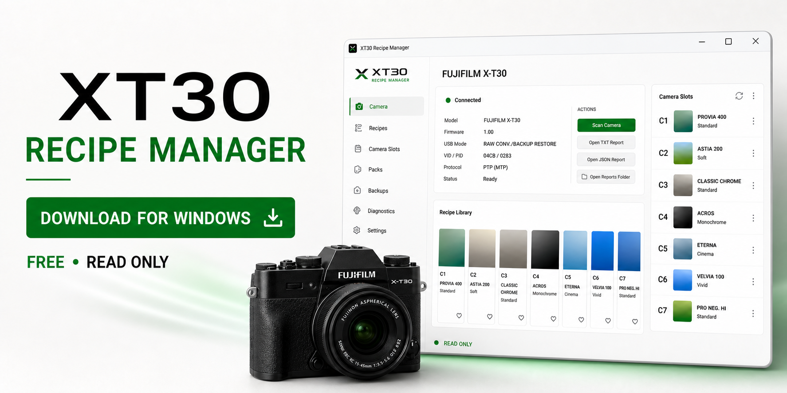
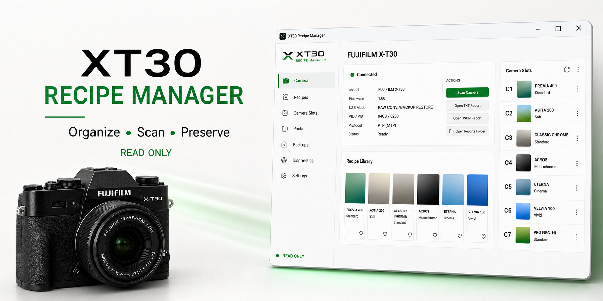
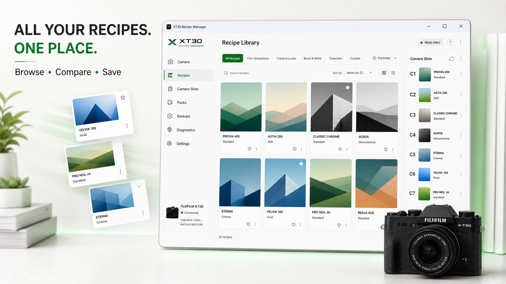

# Visuels promotionnels GitHub

Ces visuels ont été générés pour présenter **XT30 Recipe Manager** sur GitHub.
Ils utilisent des vignettes abstraites originales et ne contiennent aucune photo
provenant de Fuji X Weekly ou d'une autre bibliothèque de recettes.

## Bannière de téléchargement

Usage recommandé : page Releases ou section de téléchargement du README.

## Bannière principale

Usage recommandé : en-tête du README.

## Social preview

Usage recommandé : image sociale du dépôt GitHub.

## Bibliothèque de recettes

Usage recommandé : section Fonctionnalités du README.

